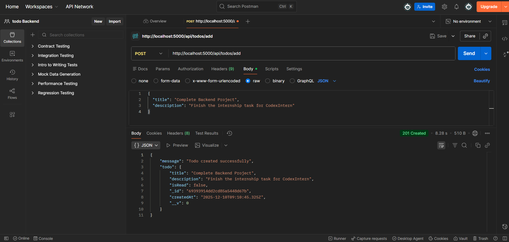
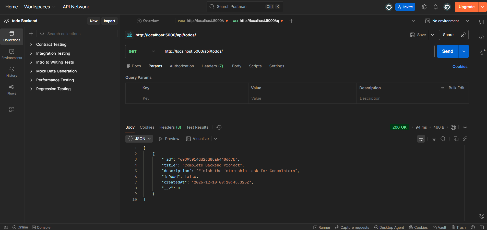
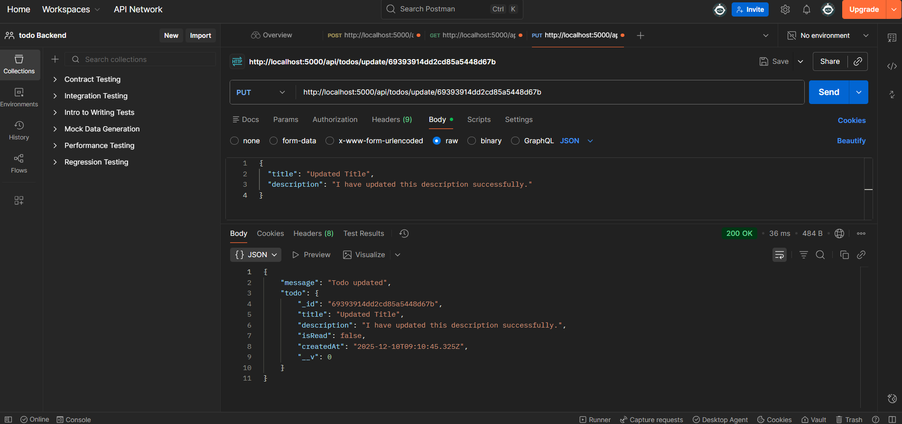
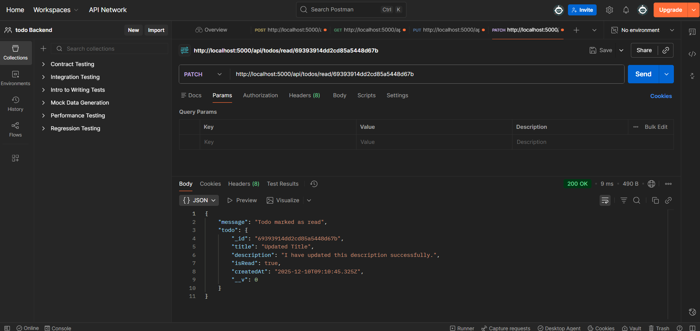
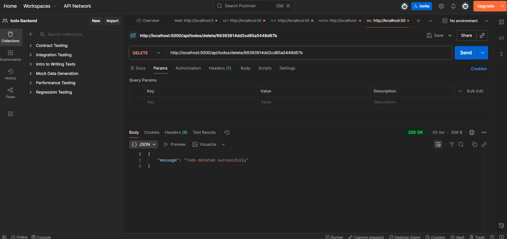

# Todo Backend API

This is a backend implementation for a Todo Application. It was created as part of the Backend Development Internship assessment [Slab 1].

## Features
- **Create Todo**: Add new tasks.
- **Update Todo**: Edit existing tasks.
- **Delete Todo**: Remove tasks.
- **Mark as Read**: Mark specific tasks as completed/read.

## Tech Stack
- Node.js
- Express.js
- MongoDB

## Setup
1. Clone the repository.
2. Run `npm install` to install dependencies.
3. Configure `.env` with your `MONGO_URI`.
4. Run `node server.js` to start the server.

## API Execution Screenshots

### 1. Create Todo

### 2. Get All Todos

### 3. Update Todo

### 4. Mark as Read

### 5. Delete Todo
